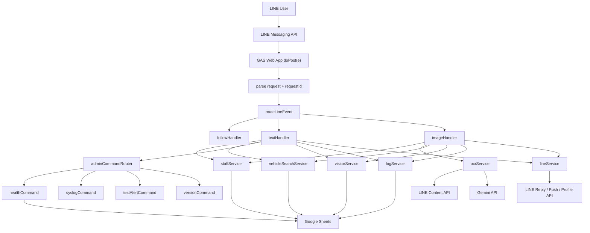
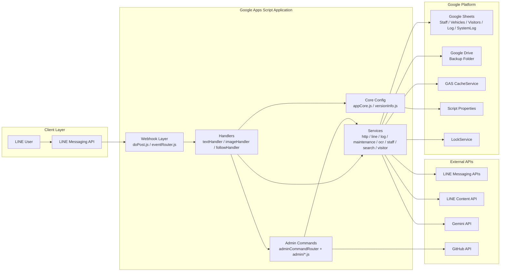
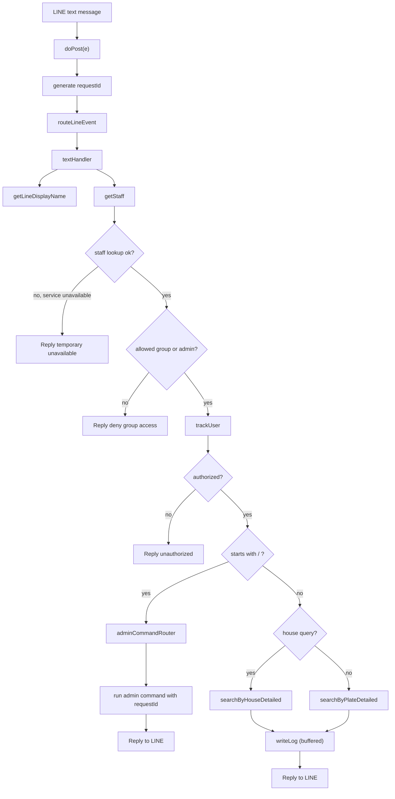
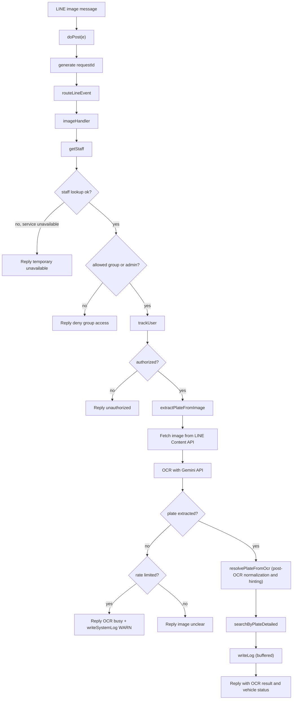
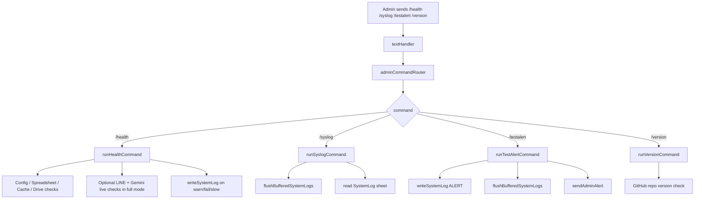
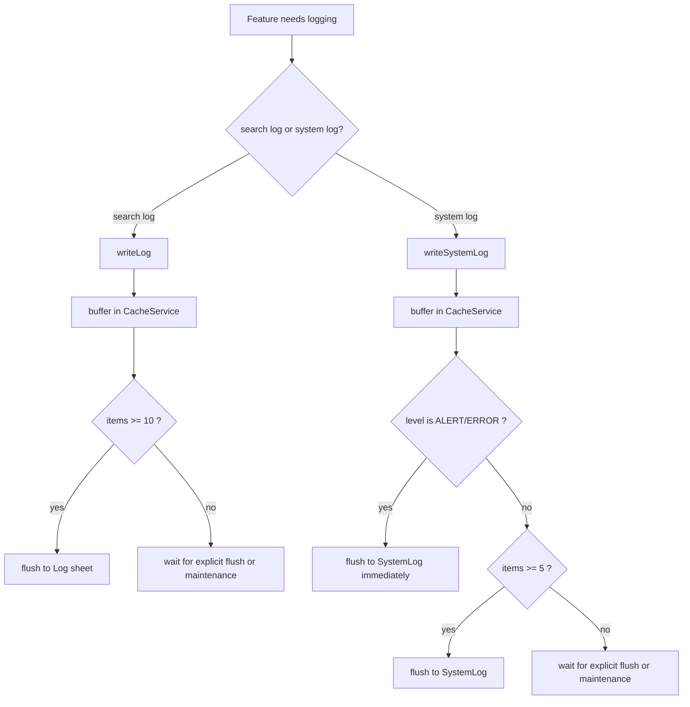
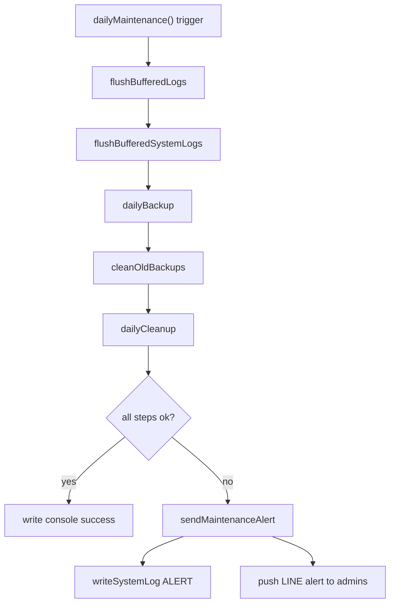
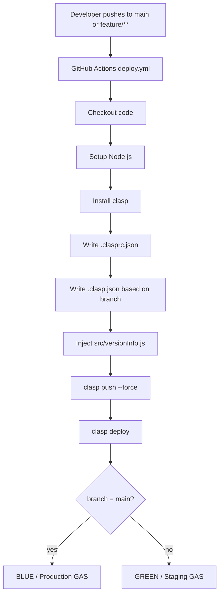

# Architecture and Process Flow

เอกสารนี้สรุป flow การทำงานของระบบตั้งแต่รับ webhook จาก LINE ไปจนถึงการค้นหาข้อมูล, OCR, admin commands, health checks, logging, maintenance และ deployment เพื่อใช้เป็นภาพรวมสำหรับการดูแลระบบและรีวิวการเปลี่ยนแปลง

## 1. System Overview



## 2. Component Map



## 3. Text Query Flow



## 4. OCR Image Flow



หมายเหตุ: `resolvePlateFromOcr()` เป็นขั้นตอน post-processing หลัง OCR เพื่อ normalize ข้อความ, สร้าง candidate และช่วยจับคู่กับข้อมูลทะเบียนที่มีอยู่ ไม่ได้ทำหน้าที่เป็น OCR model โดยตรง

## 5. Admin and Ops Flow



## 6. Logging and Fail-soft Flow



## 7. Maintenance Flow



## 8. Request Tracing

- `doPost(e)` สร้าง `requestId` สำหรับ request ใหม่
- `eventRouter`, handlers และ admin commands จะส่ง `requestId` ต่อไป
- `SystemLog` บันทึก `REQUEST_ID` เพื่อใช้ trace incident
- `/syslog` แสดง `req:` ให้เช็กความเชื่อมโยงของ event ได้เร็วขึ้น

## 9. Main Components

- `src/appCore.js`
  เก็บ shared config, column map, trigger hooks, admin alert helper
- `src/webhook/doPost.js`
  รับ webhook, parse payload, สร้าง `requestId`, log invalid payload
- `src/webhook/eventRouter.js`
  แยก follow, text, image
- `src/handlers/textHandler.js`
  flow ค้นหาข้อความ, help, `/myid`, admin command entry point
- `src/handlers/imageHandler.js`
  flow OCR จากภาพ และ fallback กรณี OCR fail/rate limit
- `src/services/httpService.js`
  wrapper สำหรับ retry, timeout และ error handling ของ external HTTP
- `src/services/staffService.js`
  lookup staff, cache, graceful handling เมื่อ Sheets มีปัญหา
- `src/services/vehicleSearchService.js`
  ค้นหาทะเบียนและบ้านเลขที่
- `src/services/ocrService.js`
  OCR integration, cleanup, normalization, candidate generation และ OCR-aware matching heuristics
- `src/services/visitorService.js`
  อัปเดตผู้ใช้ที่เคยใช้งาน พร้อม row map cache
- `src/services/logService.js`
  จัดการ `Log`, `SystemLog`, buffering, flush และ auto-create `SystemLog`
- `src/services/maintenanceService.js`
  backup, cleanup, retention และ alert เมื่อ maintenance fail บางส่วน
- `src/commands/admin/*.js`
  แยก logic รายคำสั่ง เช่น `/health`, `/syslog`, `/testalert`, `/version`
- `tests/pure-logic.test.js`
  local automated tests สำหรับ pure logic

## 10. Deployment Flow



## 11. Automated Tests

ก่อน deploy หรือก่อน push logic สำคัญ แนะนำให้รัน local tests ดังนี้

```bash
node tests/pure-logic.test.js
```

หรือ:

```bash
npm test
```

ชุด test ปัจจุบันครอบคลุมหัวข้อหลักดังนี้

- plate normalization
- OCR cleanup
- OCR candidate generation
- OCR result resolution
- edit distance
- string similarity

## 12. Vehicles Sheet Schema

```text
license_plate | brand | model | color | house_no | owner_name | status | vehicle_type
```

- `vehicle_type` should use English values: `car` or `motorcycle`
- Runtime normalizes the first 8 `Vehicles` headers to this schema before reading sheet data
- Search and OCR reply messages use the car icon for `car` rows and the motorcycle icon for `motorcycle` rows

