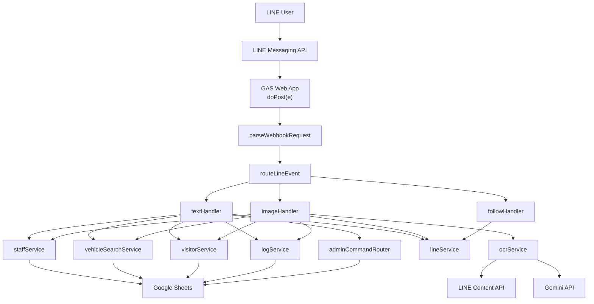
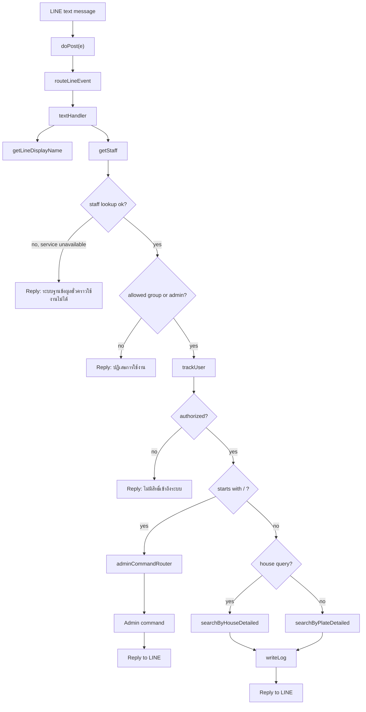
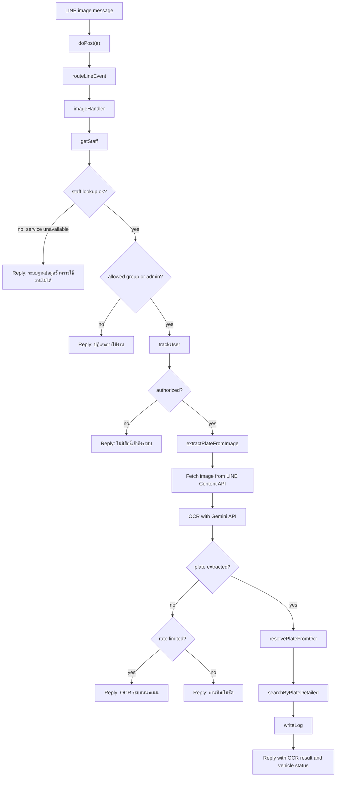
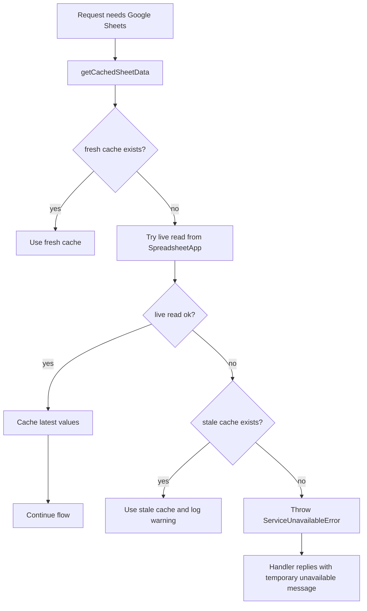
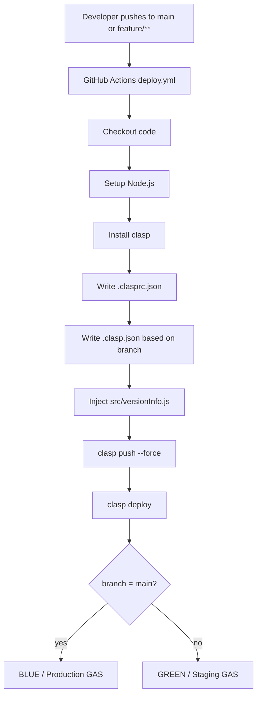

# Architecture and Process Flow

เอกสารนี้สรุป flow การทำงานของระบบตั้งแต่รับ webhook จาก LINE ไปจนถึงค้นหาข้อมูล, OCR, admin commands และ deployment

## 1. System Overview

## 2. Text Query Flow

## 3. OCR Image Flow

## 4. Backend Degradation Flow

## 5. Deployment Flow

## 6. Main Components

- `src/webhook/doPost.js`: รับ webhook และกัน error ชั้นนอก
- `src/webhook/eventRouter.js`: แยก follow, text, image
- `src/handlers/textHandler.js`: flow ค้นหาข้อความและ admin entry point
- `src/handlers/imageHandler.js`: flow OCR จากภาพ
- `src/services/staffService.js`: lookup staff, cache, graceful handling เมื่อ Sheets มีปัญหา
- `src/services/vehicleSearchService.js`: ค้นหาทะเบียนและบ้านเลขที่
- `src/services/ocrService.js`: OCR, normalization, fuzzy matching
- `src/services/logService.js`: เขียน log แบบ fail-soft
- `src/services/visitorService.js`: อัปเดตผู้ใช้ที่เคยใช้งานแบบ fail-soft
- `src/services/maintenanceService.js`: backup และ cleanup jobs
- `.github/workflows/deploy.yml`: deploy ไป GAS อัตโนมัติตาม branch
